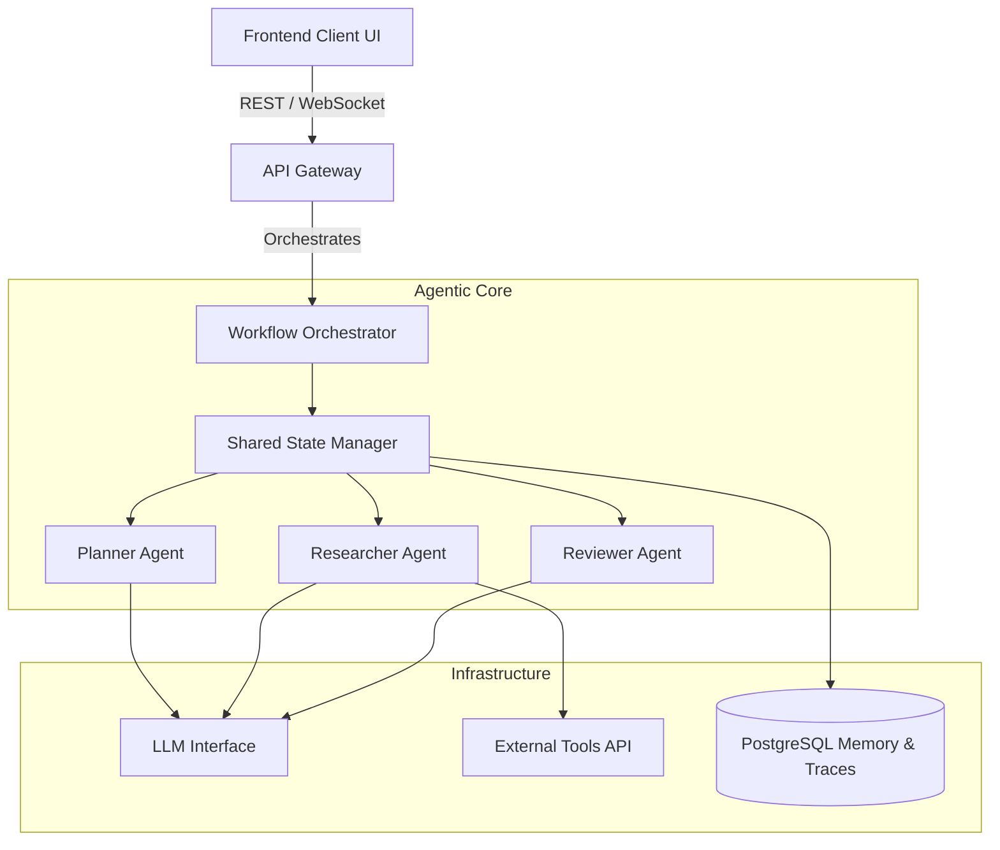

# 🏗️ Architecture
## Nexus Research Intelligence Platform

> **Status:** Discovery
> **Phase:** 1 - Foundation

---

## 1. Architectural Philosophy

Nexus is designed according to **Clean Architecture** principles. The overarching goal is to separate the framework-agnostic **core intelligence logic** (how agents think, plan, and execute) from **infrastructure** (the UI, databases, LLM APIs). 

### Key Principles
1. **Separation of Concerns:** The core agent logic should not know about FastAPI, React, or PostgreSQL.
2. **Framework-Agnostic Intelligence:** Prompts, state definitions, and cognitive workflows are pure code and should be portable.
3. **Observable by Default:** Every node, edge, and state transition in the system must emit structured trace data.
4. **Pluggable LLMs:** Model routing is dynamic. We can swap out OpenAI, Anthropic, or local open-source models easily based on capability and cost needs.

---

## 2. High-Level System Architecture

---

## 3. Core Components

### 3.1 Orchestrator (The Graph)
Nexus operates as a **State Machine** or **Graph**, where each Agent acts as a node. The orchestrator is responsible for routing the flow of control from one agent to the next based on the evaluation of the shared state.

### 3.2 Shared State (The Memory)
Agents never pass context directly through hidden, unobservable string prompts to one another. Instead, they read from and mutate a strictly typed **Shared State** object. (See `STATE.md`).

### 3.3 Agents (The Actors)
An agent is simply a pure function or bounded context that takes the Shared State as input, interacts with an LLM and/or Tools, and outputs a mutation to the Shared State. (See `AGENTS.md`).

### 3.4 Tools (The Hands)
Tools are isolated, sandboxed functions that agents can call. They range from web scraping to database queries. Tools must be explicitly defined and strictly validated to prevent failure cascades.

---

## 4. Why this Architecture?

By decoupling agents into specialized pure functions that mutate a single structured state, we achieve:
* **Traceability:** We can pause, rewind, or inspect the state at any node.
* **Human-in-the-Loop:** We can pause execution before critical state transitions to require human approval.
* **Error Recovery:** If an agent fails, the orchestrator can route to a "Fixer" agent with the exact state from before the failure.

This architecture teaches us how to transition from fragile, linear chat scripts into robust, enterprise-grade AI applications.
